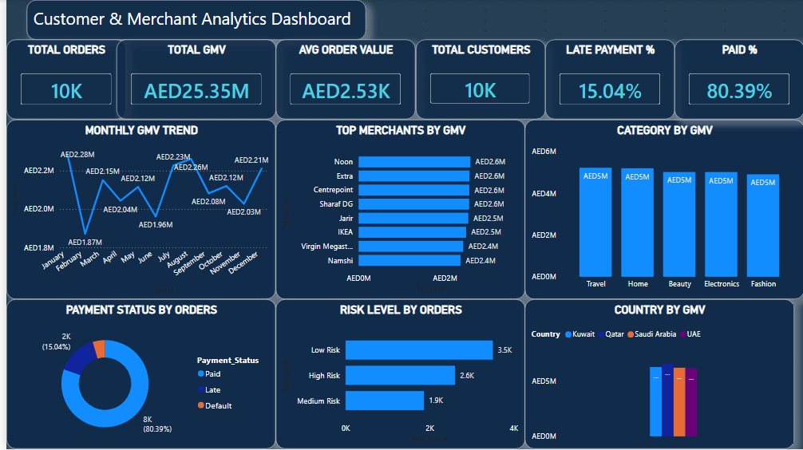

# 💳 BNPL Customer & Merchant Analytics Dashboard

> **End-to-End Product Analytics Project inspired by Buy Now Pay Later (BNPL) companies like Tabby, Tamara, Klarna, and Affirm.**



<p align="center">

<a href="https://colab.research.google.com/drive/1ImzT7b57QEhmLYLcvsqF4aKm_QX_yXVq?usp=sharing">

</a>

</p>

---

# 📌 Project Overview

This project simulates a real-world **Product Analytics** use case for a Buy Now Pay Later (BNPL) platform.

Since public BNPL datasets are limited, I generated a realistic synthetic dataset using **Python** and built a complete analytics pipeline using:

- Python
- SQL Server
- Excel
- Power BI

The dashboard helps business stakeholders monitor merchant performance, customer payment behavior, customer risk, and revenue trends.

---

# 🎯 Business Problem

A BNPL company needs answers to questions such as:

- Which merchants generate the highest GMV?
- Which product categories drive the most revenue?
- What percentage of customers pay on time?
- Which customer segments are high risk?
- Which countries contribute the highest revenue?

This dashboard provides an executive view to answer these questions.

---

# 🛠 Tech Stack

| Tool | Purpose |
|------|---------|
| 🐍 Python (Pandas, NumPy, Faker) | Data Generation & ETL |
| 🗄 SQL Server | Business Analysis |
| 📊 Excel | Data Validation |
| 📈 Power BI | Interactive Dashboard |

---

# 🔄 Project Workflow

```text
Python (Synthetic Data Generation)
            │
            ▼
Python (Data Cleaning & Feature Engineering)
            │
            ▼
SQL Server (Business Analysis)
            │
            ▼
Excel (Validation)
            │
            ▼
Power BI Dashboard
            │
            ▼
Business Insights
```

---

# 📂 Dataset

Synthetic dataset containing approximately **10,000 BNPL transactions**.

Features include:

- Customer Details
- Merchant Information
- Country
- Product Category
- Order Value
- Payment Status
- Credit Score
- Monthly Income
- Risk Level
- Customer Segment
- Order Date

---

# 🧹 ETL Process

### Data Generation
- Generated realistic customer records using **Faker**
- Simulated merchant transactions
- Generated payment behaviour

### Data Cleaning
- Removed duplicate records
- Handled missing values
- Corrected inconsistent merchant names
- Removed invalid order values

### Feature Engineering
Created additional business fields:

- Risk Level
- Age Group
- Income Band
- Customer Segment
- Order Month
- Order Year
- Quarter

---

# 🗃 SQL Analysis

Performed business analysis including:

- Total GMV
- Total Orders
- Average Order Value
- Merchant Performance
- Country Performance
- Category Performance
- Payment Status Analysis
- Customer Segmentation
- Risk Distribution
- Monthly Revenue Trend
- Window Functions
- CTEs

---

# 📊 Dashboard Features

## Executive KPIs

- ✅ Total Orders
- ✅ Total GMV
- ✅ Average Order Value
- ✅ Total Customers
- ✅ Late Payment %
- ✅ Paid %

## Interactive Visualizations

- 📈 Monthly GMV Trend
- 🏪 Top Merchants by GMV
- 📦 Revenue by Category
- 🌍 Revenue by Country
- 💳 Payment Status Distribution
- ⚠ Risk Level Distribution

---

# 📸 Dashboard Preview


---

# 💡 Key Business Insights

- Generated **AED 25.35M** GMV across **10,000** transactions.
- Approximately **80.39%** of customers paid on time.
- Around **15.04%** of transactions experienced late payments.
- **Noon** generated the highest GMV in this synthetic dataset.
- Low-risk customers accounted for the highest number of orders.
- Revenue was distributed across multiple GCC countries and merchant partners.

---

# 📁 Repository Structure

```
BNPL-Customer-Merchant-Analytics
│
├── README.md
├── Screenshot.png
├── BNPL_Customer_Merchant_Analytics.ipynb
├── BNPL_Customer_Merchant_Analytics.pbix
├── BNPL SQL Analysis.sql
├── raw_bnpl_data.csv
└── clean_bnpl_data.csv
```

---

# 🚀 Future Improvements

- Customer Lifetime Value (CLV)
- Fraud Detection Dashboard
- Churn Prediction
- Merchant Profitability Analysis
- Machine Learning Risk Prediction
- A/B Testing Dashboard

---

# ▶️ Run the Notebook

Open directly in Google Colab:

**🔗 https://colab.research.google.com/drive/YOUR_COLAB_LINK**

Or click the **Open in Colab** badge at the top of this README.

---

# 👨‍💻 Author

**Amr Khalid Kidwai**

- 💼 LinkedIn: https://www.linkedin.com/in/amr-kidwai/
- 💻 GitHub: https://github.com/amrKidwai

---

## ⭐ If you found this project useful, consider giving it a Star!
